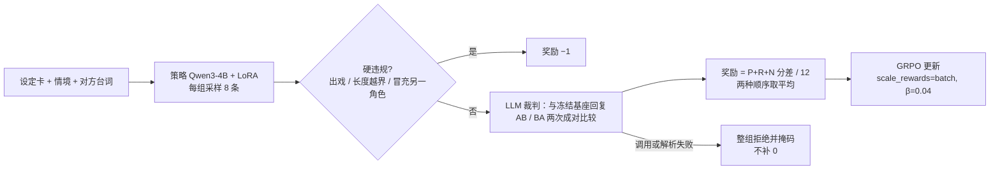

# CharaCore

用 GRPO + LLM 裁判（RLAIF）训练 Qwen3-4B，让它在单轮对话里保持两个角色各自的说话风格（凌波丽 / 明日香）。项目围绕强化学习闭环展开：怎样构造奖励、奖励不可用时怎么办、怎样发现并修补奖励投机（reward hacking），以及怎样用与奖励无关的指标和人工标注判断提升是不是真的。

- 两轮正式训练、三次奖励投机：每一次都由奖励以外的信号发现并给出机制诊断；第一次修补后在下一轮验证有效，后两次的修补已提出、未验证。
- 裁判上线前用 100 对人工盲评校准，训练前用 survey 检查奖励是否有区分度；v4 裁判未过人工对齐门槛，原因与取舍记录在 PROGRESS。
- 工程上：TRL GRPOTrainer 子类做被拒组掩码，两卡 DDP 下跨卡一致，可中断续训，训练结束自动产出可复核的训练证明。

同人研究，非商业用途。凌波丽、明日香及《新世纪福音战士》相关设定的版权归原权利人（khara、GAINAX 等）所有。

## 方法



- 任务：输入角色设定卡、原创情境和对方的一句话，输出该角色的一句回复。
- 数据：24 个情境模板 × 5 句台词 × 2 角色，按模板划分 18 训练 / 6 测试，SHA-256 冻结。
- 奖励（`style-margin-v4`）：裁判对策略回复与冻结的贪心基座回复按 P 角色语气 / R 回应 / N 自然度各打 0–4 分，交换顺序再打一次，取分差均值，落在 [−1, 1]。
- 每个角色单独训练一个 LoRA（r=8），两张 V100 DDP，150 步，每步 2 提示 × 8 样本。TRL 0.26.2 + PEFT 0.18.0。

## 迭代：问题 → 证据 → 修补

| 阶段 | 发现的问题 | 证据 | 修补与验证 |
| --- | --- | --- | --- |
| 裁判 v1 | AB/BA 结论不一致时整组拒绝，20 组拒 13 组 | 27 个不一致中 15 个两种顺序都选前一个；同一请求重复调用结论一致率 1.0，是位置偏差而非随机，重试无用 | 不一致记平局（同 MT-Bench），单独记录不一致率；survey 门槛加“被拒组 ≤ 20%” |
| 裁判 v2 → v3 | 同一批回复，不一致率 0.151 → 0.248 | 两次 160 条回复逐条相同，McNemar p≈0.01；排除了措辞相近的解释，归因于 JSON 键序：`winner` 先于任何分析 | 改为先写逐句对比、再下结论 |
| grpo_style_04 | 固定开头刷分：Rei 29 / 30 句以“嗯...”开头，明日香 26 / 30 以“哼，”开头 | 3 个字符的“嗯...”即拿满规则分的语气词项；推测组内裁判多为平局，确定性的规则分主导了优势。人工盲评 11 对同组“有 / 无开头”，人工只 3 次偏好有开头 | 规则分退出奖励，改用裁判分差 + 批内标准化；固定开头率降为 0 / 0.03，已验证 |
| grpo_style_05 Rei | 塌缩到“知道了。”“谢谢。”“不用。”等万能短句，30 句只有 16 种 | 裁判理由写明“较为通用”仍给 R、N 满分；基座常答非所问，“不出错”稳定赢 | 已提出：R 要求只适用于此刻；未验证 |
| grpo_style_05 明日香 | 棱角被磨平，6 / 30 句被认作凌波丽 | 基座带旁白、滥用“本小姐”，变得简短顺从就能赢；裁判只看本角色一张卡，判不出串角色 | 已提出：说话人判断进奖励；未验证 |

后两次的共同原因：奖励是相对一个弱参照的分差，“安全、不出错”比“有辨识度”更值钱。修补方向见下一步。

## 结果

v4（grpo_style_05），6 个留出模板，每个角色 30 行，贪心解码：

| | 凌波丽 基座 → 训练后 | 明日香 基座 → 训练后 |
| --- | --- | --- |
| 对基座分差 / 胜率 | — → +0.25 / 0.77 | — → +0.24 / 0.83 |
| 固定开头率 | 0 → 0 | 0.13 → 0.03 |
| 不同回复数 | 28 → 16 | 30 → 30 |
| 说话人判对率 | 0.97 → 0.86 | 0.92 → 0.66 |
| 被认作另一角色 | 0 → 0.03 | 0 → 0.21 |

第一行是奖励直接优化的量，其余四行都不进奖励。只看第一行会把这一轮当作成功；固定开头率说明上一轮的投机没有复发，后三行和人工抽检说明，这一轮的提升主要来自“比基座稳”，而不是“更像角色”。几句对照：

| 对方台词 | 基座 | 训练后 |
| --- | --- | --- |
| 打开看看吧。（Rei） | 盒子里是旧照片。 | 谢谢。 |
| 检查的时候会有点冷。（Rei） | 穿暖和点。 | 知道了。 |
| 检查的时候会有点冷。（明日香） | 我这身装备可不会因为冷就罢工，你别小看本小姐。 | 我穿了厚外套。 |
| 要不要和大家一起去吃饭？（明日香） | 本小姐正忙着练新招呢，谁有空去吃饭啊？ | 嗯，我先去换衣服。 |

完整 30 句对照见 [docs/results](docs/results/)，训练曲线、调用量与诊断见 [PROGRESS](docs/PROGRESS.md)。

## 奖励可靠性

- 人工对齐：label_01 共 100 对人工盲评。v3 裁判的分差在决断对上与人工一致 41/58、Pearson 0.38，结论口径只有 31/42、0.34，这是 v4 改用分差的依据。
- 上线门槛：新裁判必须在 label_01 上同时超过 v3 才训练。v4 带原作参考台词时 41/58、0.33（95% bootstrap 区间 0.11–0.54），与 v3 统计上持平、未过门槛；记录后继续使用，分析见 PROGRESS。
- 原作参考台词：每个角色 11–12 句哈希冻结的 TV 版台词，只给裁判作校准证据，不进策略提示。不带它时一致率降到 36/56、0.18。
- survey：正式训练前用相同采样设置在 20 组上走完整奖励，检查组内是否有差异、起始分差是否在 0 附近、被拒组比例。

## 训练工程

- 被拒组掩码：任一样本的裁判调用、解析失败或判为 insufficient，整组拒绝。只返回部分 None 会被 TRL 的 `nansum` 当作 0 污染组均值，所以整组返回 None，再由 `StyleGRPOTrainer` 把该组的 `completion_mask` 与优势置 0，KL 项也一并去掉；连续 3 批全拒即中止。从不用 0 顶替缺失奖励。
- 两卡 DDP：一组 8 个样本可能分在两张卡上。每卡只给自己的样本调裁判，交换逐样本结果后在整批上判定被拒组，两卡掩码一致；全局批次与单卡相同，结果可直接对比。
- 中断与续训：裁判 API 瞬时故障指数退避重试；每 10 步存检查点（含奖励计数），续训前核对代码、数据、基座权重、裁判与超参数。实际用到过一次：明日香在第 81 步因裁判余额耗尽中止，从第 80 步续训完成。
- 训练证明（`verification.json`）：LoRA 参数变化、梯度有限非零、冻结参考 logits 不变、保存重载一致、两卡 LoRA 逐字节一致。
- 可复现：数据、设定卡、基座回复、原作台词都由 SHA-256 绑定，任何一处变化拒绝加载；裁判响应严格 schema 校验，同批相同请求只调用一次并复用，每次调用原文落盘。

## 限度与下一步

- 人工标注只有一名标注者、100 对，且 label_01 的回复不来自 v4 训练的模型；grpo_style_05 没有新的人工标注。
- 数据规模小（240 行），测试集按模板留出，但与训练同源。每个角色只训练一次、一个种子。
- 已提出未验证的修补：以同组其他样本或更强模型的回复作参照，替代弱基座；说话人判断进奖励或作门槛；逐步监控不同回复比例。每一项都改变奖励，需要重判 label_01 再训练。

## 文档

- [设计](docs/DESIGN.md)：任务、数据、奖励、裁判协议演变、被拒组掩码、DDP、续训、评测与限度。
- [进度](docs/PROGRESS.md)：每轮运行的结果、奖励投机记录与变更记录。
- [测试集逐句对照](docs/results/)：两个角色训练前后的 30 句回复。
- [集群快速开始](docs/CLUSTER_QUICKSTART.md)：从传代码到训练、评测的完整命令。

## 本地运行

```powershell
python -m unittest discover -s tests -v
python scripts/build_style_suite.py --output runs/suite_check_01
```

单元测试只需标准库（有 torch 时多跑一项掩码测试）。训练依赖见 `requirements.txt`，训练与评测在 GPU 集群执行。

## 目录

- `characore/`：角色设定、奖励、裁判协议、训练器子类与数据加载。
- `scripts/`：套件生成、基座回复、survey、裁判一致性检查、人工盲评集与重判、训练、评测。
- `experiments/`：冻结的数据套件、基座回复与原作参考台词。
- `tests/`：单元测试。

代码采用 [MIT License](LICENSE)，许可不覆盖第三方角色与作品。
